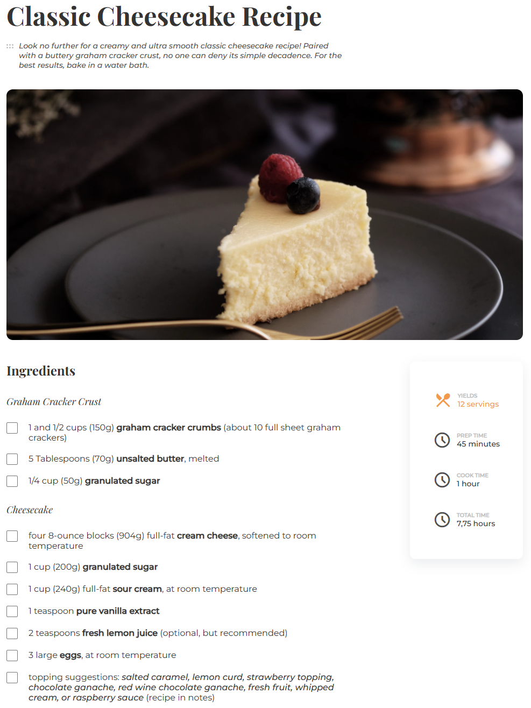
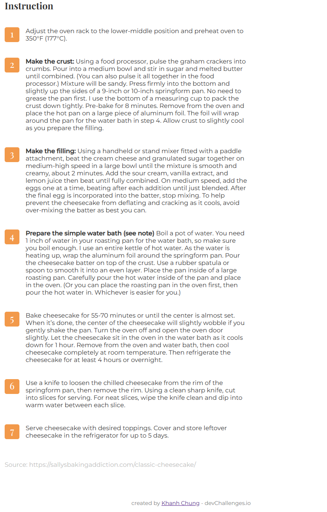
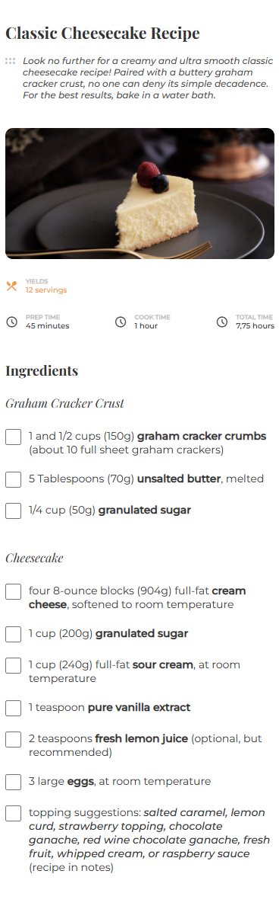
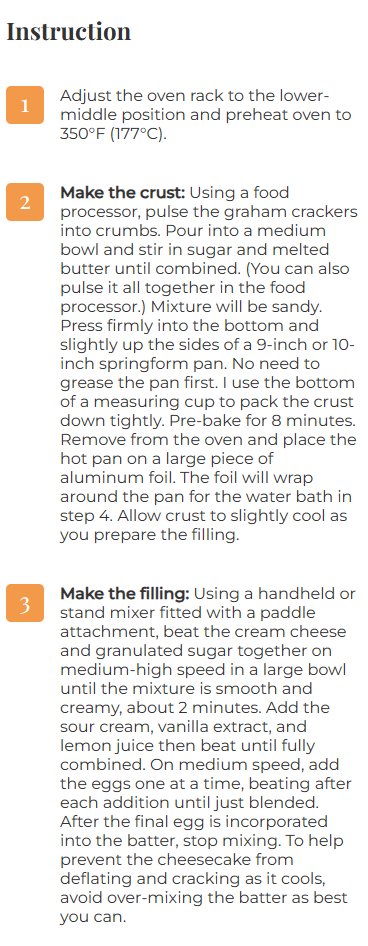
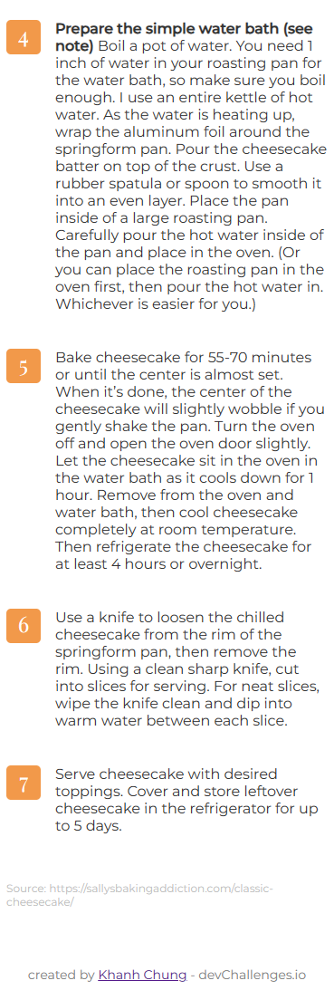

<!-- Please update value in the {}  -->

<h1 align="center">Recipe Page</h1>

<div align="center">
   Solution for a challenge from  <a href="http://devchallenges.io" target="_blank">Devchallenges.io</a>.
</div>

<div align="center">
  <h3>
    <a href="https://recipe-page-c0c02.web.app/">
      Demo
    </a>
    <span> | </span>
    <a href="https://github.com/craftzmask/recipe-page">
      Solution
    </a>
    <span> | </span>
    <a href="https://devchallenges.io/challenges/OEKdUZ6xs0h99C38XVht">
      Challenge
    </a>
  </h3>
</div>

<!-- TABLE OF CONTENTS -->

## Table of Contents

- [Overview](#overview)
  - [Built With](#built-with)
- [Features](#features)
- [How to use](#how-to-use)
- [Contact](#contact)
- [Acknowledgements](#acknowledgements)

<!-- OVERVIEW -->

## Overview
#### Main Page



#### Mobile Page




Introduce your projects by taking a screenshot or a gif. Try to tell visitors a story about your project by answering:

- Where can I see your demo?
  - You can see it [here](https://recipe-page-c0c02.web.app/).
- What was your experience?
  - It was much easier than My Team Page challenge.
- What have you learned/improved?
  - Mostly Flexbox. I made a lot of mistakes when doing this challenge.
- Your wisdom? :)
  - The only man who never makes mistakes is the man who never does anything.

### Built With

<!-- This section should list any major frameworks that you built your project using. Here are a few examples.-->

- HTML
- CSS

## Features

<!-- List the features of your application or follow the template. Don't share the figma file here :) -->

This application/site was created as a submission to a [DevChallenges](https://devchallenges.io/challenges) challenge. The [challenge](https://devchallenges.io/challenges/TtUjDt19eIHxNQ4n5jps) was to build an application to complete the following user stories:

- [x] User story: I can see a recipe with ingredients and instructions
- [x] User story: I can select a checkbox if I have the ingredients
- [x] User story: I can see the number of servings, baking times

## How To Use

To clone and run this application, you'll need [Git](https://git-scm.com) and a browser such as Google

```bash
# Clone this repository
$ git clone https://github.com/craftzmask/recipe-page
```

## Acknowledgements

<!-- This section should list any articles or add-ons/plugins that helps you to complete the project. This is optional but it will help you in the future. For exmpale -->

- [CSS-Tricks](https://css-tricks.com/snippets/css/a-guide-to-flexbox/)

## Contact

- GitHub [craftzmask](https://github.com/craftzmask/)
